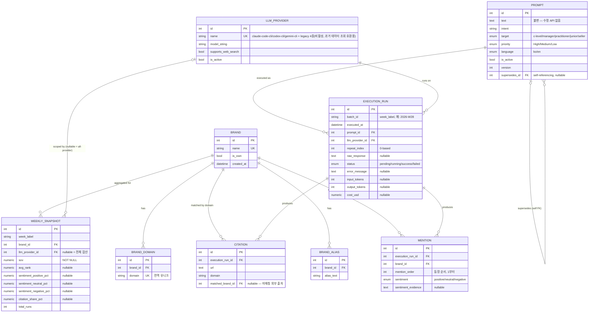

# 데이터 모델 ERD

이 문서는 `backend/app/models/`의 SQLAlchemy ORM 모델을 그대로 옮긴 다이어그램이다. 모델 코드가
단일 진실 원천(SSOT)이며, 이 문서와 실제 모델이 어긋나면 모델 코드가 맞다 — 마이그레이션을 추가한
뒤에는 이 문서도 함께 갱신한다. 지표 계산식(스코프/분자/분모)은 [docs/metrics.md](metrics.md)를
본다.

## 1. ERD (mermaid)

## 2. 테이블별 핵심 제약/설계 메모

이 절은 마이그레이션 파일과 모델의 `__table_args__`를 읽지 않고도 "왜 이렇게 만들었는지"를
빠르게 파악하기 위한 요약이다. 정확한 제약 조건은 항상 모델 코드(`app/models/*.py`)를 본다.

| 테이블 | 핵심 제약 | 왜 |
|---|---|---|
| `brand` | `name` 유니크 | 브랜드는 ID로만 참조하지만(CLAUDE.md), 이름 중복 자체는 운영 실수이므로 막는다 |
| `brand_domain` | `domain` **전역** 유니크 | 인용 URL의 도메인 → 브랜드 매칭이 1:1이어야 한다(두 브랜드가 같은 도메인을 가질 수 없음) |
| `brand_alias` | `(brand_id, alias_text)` 유니크 | 같은 브랜드에 같은 별칭을 중복 등록하는 것만 막는다 — 별칭 텍스트 자체는 브랜드 간 겹칠 수 있다 |
| `prompt` | 텍스트 수정 API 없음, `supersedes_id` self-FK | 프롬프트 불변 규칙(CLAUDE.md) — 새 버전은 새 row, `version`은 `supersedes.version + 1` |
| `llm_provider` | `name` 유니크 | `app/llm_clients/factory.py`가 이 `name`으로 어댑터 클래스를 찾는다 — 바뀌면 기존 execution_run의 프로바이더 참조가 어댑터 매핑과 끊긴다(그래서 관리 API도 `name` 수정을 막는다) |
| `execution_run` | `(batch_id, prompt_id, llm_provider_id, repeat_index)` 유니크 | 배치 재트리거/resume 시 같은 잡이 중복 생성되지 않게 하는 멱등성 키 |
| `mention` | `(execution_run_id, brand_id)` 유니크, `mention_order >= 1` | 한 실행당 브랜드당 대표 등장 순서 하나만 기록(최초 등장 기준) |
| `citation` | `matched_brand_id` nullable | 외부 매체 등 추적 브랜드가 아닌 출처는 매칭되지 않고 남는다(docs/metrics.md §4) |
| `weekly_snapshot` | `(week_label, brand_id, llm_provider_id)` 유니크 + `llm_provider_id IS NULL` 부분 유니크 인덱스(`postgresql_where=`) | 프로바이더별 스코프 행과 전체 합산 스코프 행(`llm_provider_id=NULL`)을 한 브랜드+주에 각각 하나씩만 허용. 이 프로젝트는 PostgreSQL 전용이라 `sqlite_where`는 지정하지 않는다(참고 프로젝트는 SQLite/Postgres 양쪽을 다 지원해 둘 다 지정했었다) |

## 3. FK 삭제 동작(cascade) 요약

- `brand` 삭제 → `brand_alias`/`brand_domain`은 `cascade="all, delete-orphan"`으로 함께 삭제된다.
  (단, 실제 운영에서 브랜드를 삭제하는 관리 API는 없다 — 별칭/도메인만 전체 교체(PUT) 방식으로
  관리한다. `mention.brand_id`/`citation.matched_brand_id`/`weekly_snapshot.brand_id`는 `ondelete`
  지정이 없으므로, 브랜드를 DB에서 직접 삭제하면 과거 데이터가 참조 무결성 위반으로 막힌다 — 의도된
  설계다: 브랜드는 "비활성화"만 가능하고 삭제는 지원 대상이 아니다.)
- `execution_run` 삭제 → `mention`/`citation`은 `ondelete="CASCADE"`로 함께 삭제된다. 하지만 배치
  파이프라인 어디에도 `execution_run`을 삭제하는 코드가 없다 — resume 시에도 같은 row를 업데이트할
  뿐이다(`app/services/batch_runner.py`, `app/worker/daemon.py`).
- `prompt` 삭제는 지원하지 않는다(비활성화만). `supersedes_id`는 `ondelete` 지정이 없어, 만약 옛
  버전을 강제로 지우면 새 버전의 `supersedes_id`가 참조 무결성 위반으로 막힌다 — 프롬프트 불변
  원칙과 일관된 동작이다.

## 4. 변경 이력

| 날짜 | 변경 내용 |
|---|---|
| 2026-07-13 | 참고 프로젝트(20260709) STEP 7: 최초 작성 |
| 2026-07-15 | Flask+PostgreSQL 재개발: `weekly_snapshot` 부분 유니크 인덱스에서 `sqlite_where` 제거(PostgreSQL 전용이 되며 불필요) |
